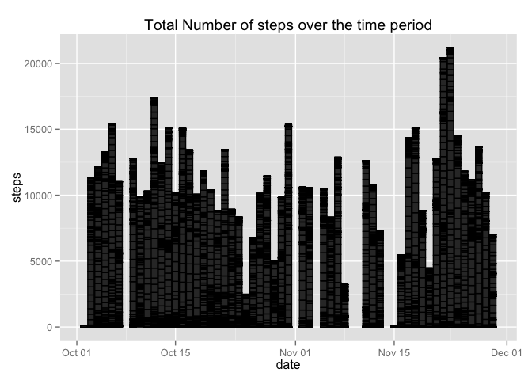

# Reproducible Research: Peer Assessment 1


## Loading and preprocessing the data


```r
#load required libraries
library(ggplot2)
library(plyr)
library(sqldf)
```

```
## Loading required package: gsubfn
## Loading required package: proto
```

```
## Warning: unable to load shared object '/Library/Frameworks/R.framework/Resources/modules//R_X11.so':
##   dlopen(/Library/Frameworks/R.framework/Resources/modules//R_X11.so, 6): Library not loaded: /opt/X11/lib/libSM.6.dylib
##   Referenced from: /Library/Frameworks/R.framework/Resources/modules//R_X11.so
##   Reason: image not found
```

```
## Could not load tcltk.  Will use slower R code instead.
## Loading required package: RSQLite
## Loading required package: DBI
## Loading required package: RSQLite.extfuns
```

```r
activity <- read.csv(unz("activity.zip", "activity.csv"), header =TRUE)

##need as a date to try stuff out
activity$date <- (as.POSIXct(as.character(activity$date), format = "%Y-%m-%d", tz = ""))

##let's take the 0's out as the number of 0's makes the median 0 and distorts the dateset
new_activity <- subset(activity,!steps %in% c(0))
```


## What is mean total number of steps taken per day?


```r
##histogram for total number of steps
ggplot(new_activity, aes(x=date, y=steps)) + geom_bar(stat="identity", color = "lightblue")  + ggtitle("Total Number of steps over the time period")
```

```
## Warning: Removed 2304 rows containing missing values (position_stack).
```

 

```r
##does the mean/median stuff
SDI <- ddply(new_activity, c("date"), function(X) data.frame(Mean_steps = mean(X$steps, na.rm=TRUE), median_steps = quantile(X$steps, 0.50, na.rm=TRUE)))


SDI
```

```
##          date Mean_steps median_steps
## 1  2012-10-01        NaN           NA
## 2  2012-10-02      63.00         63.0
## 3  2012-10-03     140.15         61.0
## 4  2012-10-04     121.16         56.5
## 5  2012-10-05     154.58         66.0
## 6  2012-10-06     145.47         67.0
## 7  2012-10-07     101.99         52.5
## 8  2012-10-08        NaN           NA
## 9  2012-10-09     134.85         48.0
## 10 2012-10-10      95.19         56.5
## 11 2012-10-11     137.39         35.0
## 12 2012-10-12     156.59         46.0
## 13 2012-10-13     119.48         45.5
## 14 2012-10-14     160.62         60.5
## 15 2012-10-15     131.68         54.0
## 16 2012-10-16     157.12         64.0
## 17 2012-10-17     152.86         61.5
## 18 2012-10-18     152.36         52.5
## 19 2012-10-19     127.19         74.0
## 20 2012-10-20     125.24         49.0
## 21 2012-10-21      96.93         48.0
## 22 2012-10-22     154.71         52.0
## 23 2012-10-23     101.34         56.0
## 24 2012-10-24     104.44         51.5
## 25 2012-10-25      56.64         35.0
## 26 2012-10-26      77.02         36.5
## 27 2012-10-27     134.92         72.0
## 28 2012-10-28     110.17         61.0
## 29 2012-10-29      80.94         54.5
## 30 2012-10-30     110.33         40.0
## 31 2012-10-31     179.23         83.5
## 32 2012-11-01        NaN           NA
## 33 2012-11-02     143.24         55.5
## 34 2012-11-03     117.46         59.0
## 35 2012-11-04        NaN           NA
## 36 2012-11-05     141.07         66.0
## 37 2012-11-06     100.41         52.0
## 38 2012-11-07     135.61         58.0
## 39 2012-11-08      61.90         42.5
## 40 2012-11-09        NaN           NA
## 41 2012-11-10        NaN           NA
## 42 2012-11-11     132.72         55.0
## 43 2012-11-12     156.01         42.0
## 44 2012-11-13      90.57         57.0
## 45 2012-11-14        NaN           NA
## 46 2012-11-15      20.50         20.5
## 47 2012-11-16      89.20         43.0
## 48 2012-11-17     183.83         65.5
## 49 2012-11-18     162.47         80.0
## 50 2012-11-19     117.88         34.0
## 51 2012-11-20      95.15         58.0
## 52 2012-11-21     188.04         55.0
## 53 2012-11-22     177.63         65.0
## 54 2012-11-23     252.31        113.0
## 55 2012-11-24     176.56         65.5
## 56 2012-11-25     140.88         84.0
## 57 2012-11-26     128.30         53.0
## 58 2012-11-27     158.67         57.0
## 59 2012-11-28     212.15         70.0
## 60 2012-11-29     110.11         44.5
## 61 2012-11-30        NaN           NA
```


## What is the average daily activity pattern?


## Imputing missing values


## Are there differences in activity patterns between weekdays and weekends?
