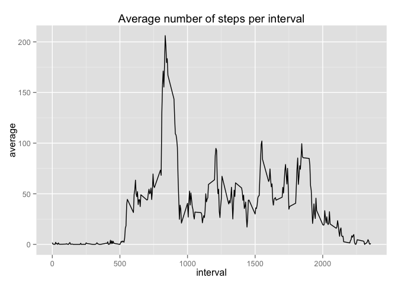

# Reproducible Research: Peer Assessment 1


## Loading and preprocessing the data

I will prepare the environment by loading the required libraries and sourcing the data assuming the activity.zip file is present in the working directory.  I will then cast the date column as a POSIX time to better display results.


```r
#load required libraries
library(ggplot2)
library(plyr)
library(sqldf)

activity <- read.csv(unz("activity.zip", "activity.csv"), header =TRUE)

##need as a date to try stuff out
activity$date <- (as.POSIXct(as.character(activity$date), format = "%Y-%m-%d", tz = ""))

##add some information on weekdays
activity$weekday <- strtrim(weekdays(activity$date), 3)
```


## What is mean total number of steps taken per day?

Plot a histogram to show the mean number of steps taken per day and then calculate the mean/median:


```r
##histogram for total number of steps
ggplot(activity, aes(x=date, y=steps)) + geom_bar(stat="identity", color = "black")  + ggtitle("Total Number of steps over the time period")
```

 

```r
##get the total number of steps per day

by_day <- sqldf("select sum(steps) as sum, date from activity group by date")

##and fix the column "sum" to be an integer
by_day$sum <- as.integer(by_day$sum)

##take the mean and the median

first_mean <- mean(by_day$sum, na.rm=TRUE)
first_median <- median(by_day$sum, na.rm=TRUE)
```

The mean/median number of total number of steps per day is therefore


```r
first_mean
```

```
## [1] 10766
```

```r
first_median
```

```
## [1] 10765
```


## What is the average daily activity pattern?

I will aggregate the average number of steps per interval, and put this into a new dataframe.  I will then plot using the now familiar *ggplot* library.


```r
daily_pattern <- sqldf("select avg(steps) as average, interval from activity group by interval")

ggplot(daily_pattern, aes(x=interval, y=average)) + geom_line()  + ggtitle("Average number of steps per interval")
```

 

We can see there is a clear pattern for night and day, with peaks of activities around breakfast, lunch, mid-afternoon and finally early evening.

## Imputing missing values

First find out the number of rows with NA's:


```r
colSums(is.na(by_day))
```

```
##  sum date 
##    8    0
```

My imputation strategy is to input the average of the total of daily steps over the observation period into those days that do not have a value:


```r
##replace missing values for Mean_steps with the average

by_day$sum[is.na(by_day$sum)] <- round(first_mean, 0)

##new histogram for total number of steps

ggplot(by_day, aes(x=date, y=sum)) + geom_bar(stat="identity", color = "black")  + ggtitle("Total Number of steps over the time period after imputation")
```

 

```r
##report on Mean and median

second_mean <- mean(by_day$sum, na.rm=TRUE)
second_median <- median(by_day$sum, na.rm=TRUE)

##report on difference

abs(second_mean - first_mean)
```

```
## [1] 0.02474
```

```r
abs(second_median - first_median)
```

```
## [1] 1
```

## Are there differences in activity patterns between weekdays and weekends?

There is no obvious difference between weekdays and weekends, looking at the maximum number of steps per interval (red) and looking at the mean (blue):


```r
by_weekday <- sqldf("select avg(steps) as sum, interval, weekday from activity group by interval, weekday order by 3")

by_weekday$weekday <- factor(by_weekday$weekday, levels= c("Mon", "Tue", "Wed", "Thu", "Fri", "Sat", "Sun"))

by_weekday <- by_weekday[order(by_weekday$weekday), ]

ggplot(by_weekday, aes(x=interval, y=sum)) + geom_line()  + ggtitle("Total Number of steps over the time period after imputation, by weekday") + facet_grid(. ~ weekday)  + geom_line(stat='hline', yintercept='mean', color='blue', linetype=1)  + geom_line(stat='hline', yintercept='max', color='red', linetype=1)
```

 

